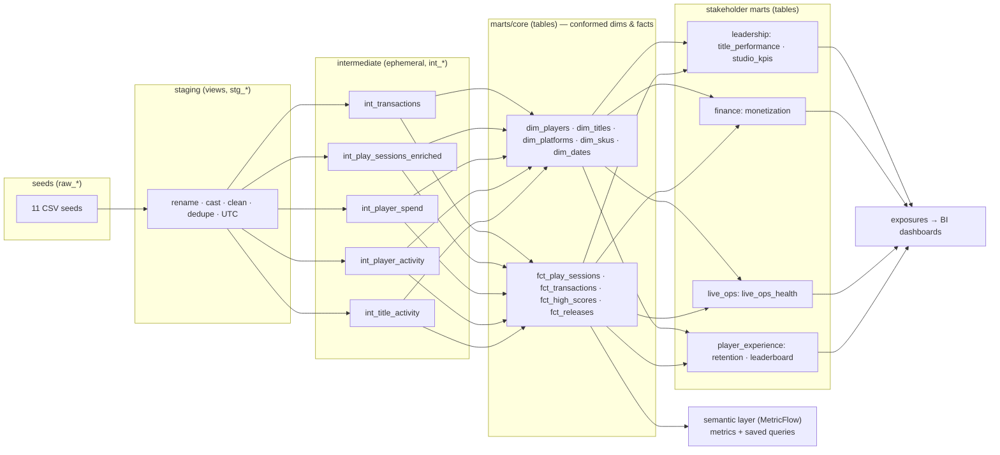

# Jaffle-Games

A dbt project for **Jaffle Games**, a ~180-person studio that ships and
operates live-service games. It models engagement, monetization, retention and release health
across an 8-title portfolio on six storefronts, and serves four stakeholder groups: studio
leadership, live ops / product, player experience, and finance.

> **The dataset is intentionally small.** The largest table is a few hundred rows. The point is
> a project that *reads* as production-grade — naming, structure, tests, contracts, docs — not
> one that stresses a warehouse. The seeds are hand-authored to tell specific stories; see
> [`setup/generate_seeds.py`](setup/generate_seeds.py) and [`setup/README.md`](setup/README.md)
> for the generator and rescaling instructions. Do not scale the data up to "make it realistic";
> if a mart looks sparse, choose a coarser grain instead.

## The business

Revenue comes from three streams — premium unit sales, in-app purchases (IAP), and season
passes — across Steam, PlayStation, Xbox, Nintendo Switch, iOS and Android. The portfolio is a
deliberate mix: a flagship live-service title carrying most of the revenue, a recent launch
still spiking, several aging premium titles in decline, and one clear sunset candidate. See
[`docs/demo-notes.md`](docs/demo-notes.md) for the stories the data supports and what to click
toward in a demo.

## Architecture



## Layer conventions

| Layer | Prefix | Materialization | Rules |
|---|---|---|---|
| Staging | `stg_` | view | 1:1 with a seed. Rename to snake_case, cast types, clean country codes, dedupe, convert transactions to UTC. No joins, no aggregation, no business logic. |
| Intermediate | `int_` | ephemeral | Reusable business logic used by more than one downstream model. |
| Marts / core | `dim_`, `fct_` | table | Conformed, shared dimensions and facts. **Model contracts enforced.** |
| Marts / domain | `mart_` | table | One folder per stakeholder group (`leadership`, `finance`, `live_ops`, `player_experience`). |

Additional conventions:

- Seeds declare explicit `column_types` in [`seeds/_seeds.yml`](seeds/_seeds.yml) — never rely on
  type inference.
- No `SELECT *` past staging. No hardcoded database or schema names — connection is configured in
  the dbt platform environment; dates and thresholds live in `vars` in `dbt_project.yml`.
- Every model has a description; every mart column has a stakeholder-useful description.
- Grain is monthly or weekly, never daily — a daily series over a few hundred sessions is mostly
  zeros.
- Tests: `unique` + `not_null` on primary keys, `relationships` on foreign keys,
  `accepted_values` on categoricals, plus singular tests in [`tests/`](tests) that encode business
  rules (session never precedes registration or platform launch, refunds never exceed gross,
  studio month net revenue never negative, transactions are converted to UTC).

## Running

This project targets Snowflake via the **dbt platform** (dbt Cloud CLI). The warehouse
connection, role, warehouse and developer schema are configured in the platform environment, so
there are no credentials in this repo.

```bash
dbt deps      # install dbt_utils
dbt debug     # confirm the platform connection
dbt seed      # load the 11 CSV seeds
dbt build     # run + test every model, snapshot and singular test
dbt docs generate   # build the documentation site
```

`dbt seed && dbt build` from a cold start should pass with zero failures using only this README
as instruction.

## Repository layout

```
models/
  staging/            stg_ views, 1:1 with seeds  (+ _staging.yml, _seeds tests)
  intermediate/       int_ ephemeral business logic
  marts/
    core/             dim_ and fct_ with contracts
    leadership/       mart_title_performance, mart_studio_kpis
    finance/          mart_monetization
    live_ops/         mart_live_ops_health
    player_experience/ mart_player_retention, mart_player_leaderboard
  semantic/           MetricFlow semantic models, metrics, saved queries
  exposures.yml       downstream dashboards per stakeholder group
macros/               clean_country_code, to_utc, signed_net_amount
tests/                singular business-rule tests
seeds/                11 CSV seeds + _seeds.yml (explicit column_types)
snapshots/            title price/sunset and player account-status history
setup/                generate_seeds.py + seed documentation
docs/                 demo-notes.md
```

## Contributing

- Add new sources as a staging model first; keep staging pure (no joins/aggregation).
- Put logic used more than once in an intermediate model rather than repeating it.
- Every new mart column needs a description a stakeholder could read and act on.
- Run `dbt build` (which runs tests) before opening a pull request. New categorical columns get
  an `accepted_values` test; new keys get `unique`/`not_null` and `relationships`.
- To reshape the demo data, edit constants in `setup/generate_seeds.py` and re-run it; never
  widen the history window or scale row counts up without a reason.
